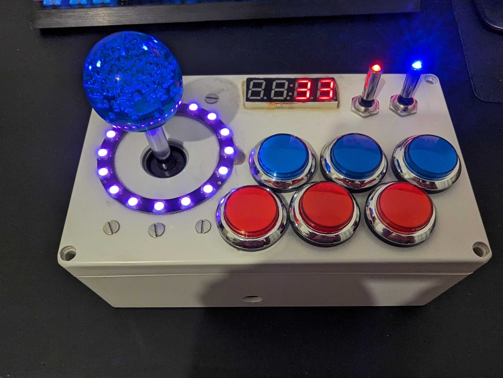

# Duplo Train Controller with ESP32-S3 Feather

This repository contains the code and resources for the 4th iteration of a Duplo train controller built using an ESP32-S3 Feather board. This iteration represents a culmination of learnings from previous iterations and offers enhanced features for controlling a Duplo train wirelessly via Bluetooth. The project features arcade buttons, a joystick, switches, LED indicators, an I2C 4-digit display, a Neopixel 16-pixel ring, and more, all integrated into a customized box.

## Features

- Control Duplo train speed with a joystick
- Trigger lights, sounds, and stop functionality with arcade buttons
- Display train speed on the I2C 4-digit display
- Create dynamic lighting effects using the Neopixel 16-pixel ring
- Use toggle switches for power control and additional functions
- Power everything via USB-C or the included LiPo battery for portability

## Iterations

### 1st Iteration

The first iteration of the project involved utilizing an Arduino Mega to trigger LEDs upon button presses. It served as the foundation for later iterations, focusing on the basic interaction with button inputs and LED outputs.

### 2nd Iteration

In the second iteration, an ESP32 was introduced along with a level shifter, enabling successful control of a Duplo train using button presses. This iteration addressed issues arising from previous AAA battery usage and shorting due to bent power pins.

### 3rd Iteration

The third iteration marked a significant advancement with a completely new PCB design powered by a LiFePO4 battery. However, issues arose concerning power consumption and the ESP32-S3's power requirements, posing challenges in achieving stable operation.

### 4th Iteration (Current)

The current 4th iteration builds upon lessons learned from previous versions. The project utilizes a single ESP32-S3 Feather board to control all functionalities, eliminating the Arduino Mega and AAA battery dependencies. This iteration aims to provide a refined and reliable Duplo train control experience. It is also using a MCP23017 GPIO Expander so only necessary GPIO is used on the Feather and no second microcontroller needs coordination.

## Setup

1. Get a Box to hold everything.
2. Get Arcade Buttons, leds, ESP32-S3 Feather board, MCP23017 Board, LiPo Battery, Neopixel Ring, Joystick, Toggle Switches and Copper-perfboard.
3. Follow the detailed wiring instructions and diagrams provided in the PCB Folder 
4. Upload the provided code to your ESP32-S3 Feather board using the Arduino IDE or PlatformIO.

## Wiring Diagram

Please take a closer look inside the pcb folder. 
To open and edit install [Fritzing](https://fritzing.org/)

## License

This project is licensed under the [Unlicense](LICENSE).

---

Designed and developed by DonPavlov.